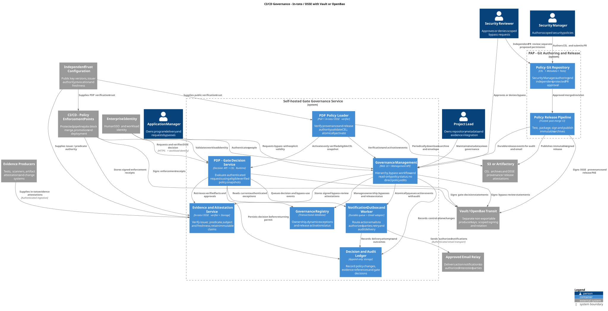

# High-level architecture

Status: proposed for review. This document describes intended behavior, not verified implementation.

## 1. Goal and boundaries

Provide a management control plane for formal software-delivery gates. Separate policy authoring (PAP), policy decisions (PDP), and enforcement (CI/CD PEPs). Central governance must not require rebuilding the pipeline for every policy change.

The service governs whether an action may proceed; it does not replace CI engines, scanners, source control, artifact repositories, or enterprise identity. Automated evidence checks and human approvals are both inputs to a decision. An approval alone is not a permit.

## 2. Hierarchy and delegated ownership

| Scope | Accountable role | Authority |
|---|---|---|
| Program | Application Manager | Own application delivery and request policy bypasses within the program; cannot author policy or approve bypasses |
| Source repository | Project Lead | Maintain repository metadata and evidence integrations; no policy-authoring or bypass-approval authority |
| Branch (optional) | Delegated repository maintainers | Maintain branch metadata within assigned repository; no policy-authoring or bypass-approval authority |

Ownership is distinct from security authority. **Security Manager** authors policies at authorized program, repository and branch scopes. **Application Manager** requests a bypass. **Security Reviewer** approves or denies that request within assigned scope. Scope changes that affect effective policy require security review; metadata management is not an indirect policy override. See [governance workflow](governance-workflow.md) for the permission matrix, lifecycle, audit and email requirements.

Proposed MVP: a repository belongs to exactly one program. Use stable provider repository IDs, not mutable names or URLs, as its identity. Moving a repository between programs requires an approved, audited operation and effective-policy preview. Branch scope is optional: absence means the repository policy applies, not absence of governance.

Environment, artifact type and gate are evaluation context, not additional ownership levels. Organization-wide mandatory baselines can be introduced later; they are not a fourth required hierarchy level.

### Inheritance and conflict handling

Effective requirements are the conjunction of applicable program, repository and branch controls. All applicable branch patterns apply; avoid undocumented first-match precedence. An exact branch match does not erase wildcard policies. Contradictory rules block publication until resolved.

Security Manager-authored child policies may add requirements or tighten thresholds through Git approval. They cannot delete parent requirements or expand permission. Every control has a stable ID, owner, applicability, evidence requirements and failure reason. The management service displays the effective policy and the scope responsible for every inherited rule; it cannot edit the baseline outside Git.

Any relaxation is a separate bypass request identifying the affected controls and versions, subject/scope, justification, requesting Application Manager, requested validity and compensating measures. Security Reviewer approval creates an active exception; a request alone grants nothing. Validity is either a defined time window or explicitly approved no-expiry. Missing expiry is never interpreted as no-expiry. Non-waivable controls cannot be excepted. Review authority must cover every affected control and scope, including inherited program controls. Ownership does not confer review authority.

For pull requests, resolve governance from the trusted target repository and target branch. Treat source refs, forks and proposed pipeline changes as untrusted inputs. Feature branches cannot choose a weaker program or impersonate a protected branch.

## 3. Logical components

The [attestation model](attestation-model.md) is mandatory across policy releases, evidence, bypass reviews, decisions and enforcement receipts. Use in-toto Statement v1 inside DSSE envelopes, signed through Vault/OpenBao Transit. Git remains the policy authority; cryptographic signing does not replace Git approval or scoped reviewer authorization.

These are logical boundaries, not a requirement to deploy separate microservices.

| Component | Responsibilities |
|---|---|
| PAP: policy Git repository and approval workflow | Security Manager authors CEL, scope bindings and tests; protected PR review approves exact revisions |
| PAP: policy release pipeline | Revalidate approved merged commit, build archive, sign exact bytes and metadata, publish immutable release to S3 or Artifactory |
| Management UI and API | Scoped RBAC, hierarchy metadata, read-only effective-policy/release views, bypass requests/reviews and exception management; no direct policy editing |
| Governance registry | Ownership, approved exceptions and release/activation status; Git and verified archives remain authoritative for baseline policy |
| S3 or Artifactory distribution storage | Immutable policy archives, signed release envelopes and discovery pointers; storage location is not a trust anchor |
| PDP bundle loader and CEL decision engine | Periodically fetch, verify signature/integrity/trust/freshness, validate and atomically activate policy; evaluate authenticated gate requests using verified snapshots |
| Evidence and approval service | Evidence metadata, provenance verification, subject binding, freshness checks, independent human approvals and revocations |
| Decision and audit ledger | Durable policy-change and decision records, actor identity, inputs/references, versions, reasons and exception usage |
| Notification outbox and email worker | Durable action events, authorized recipient resolution, email delivery through the approved relay, retries and delivery-status audit |
| Vault / OpenBao Transit | Non-exportable asymmetric signing keys, scoped workload sign permissions, rotation and key-access audit; separate producer keys |
| Attestation verification and storage | Verify DSSE, signer/predicate/scope authority, digest and freshness; preserve immutable envelopes and normalized trusted evidence |
| CI/CD adapters (PEPs) | Request decisions at mandatory boundaries, verify response binding, block on non-permit and prevent bypass paths |

Suggested starting deployment: modular management application plus independently deployable PDP replicas; relational database for transactional metadata; object storage for evidence; S3 or Artifactory for signed policy archives. CEL is the required expression language; choose a compatible CEL runtime/library and versioned typed input environment, not an alternative policy language. See [policy distribution](policy-distribution.md) for the signing, polling and activation contract.

Human SSO and workload identity use existing enterprise identity infrastructure. Vault or OpenBao Transit manages signing keys; independent protected configuration distributes public keys and signer authorization to local verifiers. A Vault token revocation alone does not revoke existing signatures. Audit access is read-only for auditors and distinct from policy administration.

## 4. Policy lifecycle and authorization

Security Manager authors CEL in Git → PR validation/tests → independent Git approval → protected merge → release CI builds and signs archive → publication to S3 or Artifactory → periodic PDP pickup → signature/integrity verification → CEL validation → atomic activation. Published and active are distinct states.

Published versions are immutable. Rollback is a new Git-approved, signed release with a higher sequence containing selected earlier policy content, not reuse of an old release pointer. Security Manager is the policy author; Application Manager and Project Lead do not receive policy-authoring rights. Git policy approval remains a separate permission; the proposed default is an independent Security Reviewer, pending confirmation. Release automation publishes only after protected Git approval. The user-confirmed Security Reviewer responsibility remains bypass approval/denial.

Scope RBAC protects every management operation and data read. For the same scope, Security Manager, Application Manager and Security Reviewer are mutually exclusive security duties; enforce this across direct and group-derived assignments. Nobody may review their own bypass request, even after a role change. Platform operators maintain infrastructure but do not automatically receive policy-authoring or bypass-approval authority. Release-gate approval is a separate permission and is not automatically granted by bypass-review authority.

## 5. Formal gate model

Initial candidate gates, to confirm in review:

| Gate | Candidate requirements | PEP boundary |
|---|---|---|
| Merge | Required review, passing tests, configured security checks | Protected merge check |
| Release/promotion | Artifact provenance, required evidence, release approval | Artifact publication or promotion job |
| Production deployment | Approved immutable artifact, change approval, environment authorization | Protected deployment job |

Each gate defines applicable subjects, mandatory controls, permitted evidence issuers, maximum evidence age, approval roles, quorum and permitted exceptions. Start MVP with one selected gate rather than all three.

## 6. Decision flow and contract

1. A protected CI/CD job authenticates using short-lived workload identity.
2. PEP requests a decision with repository ID, commit SHA, pipeline/run/job identity, gate, target environment, artifact digest where applicable, and evidence references.
3. PDP verifies workload claims and derives the authorized program/repository/ref mapping. Caller-supplied ownership is never authoritative.
4. PDP captures an eligible, signature-verified local CEL policy snapshot and obtains current authenticated active exceptions; archive signature trust is never supplied by the archive itself.
5. Evidence service verifies in-toto/DSSE evidence and bypass-review claims, authorized issuer, subject, freshness and live approval status. A scanner result for another artifact cannot satisfy this gate.
6. PDP evaluates CEL against verified facts, persists the decision, signs its in-toto gate-decision statement through Transit, and durably stores the envelope before returning it.
7. PEP locally verifies DSSE signature, authorized PDP issuer, outcome, audience, run/subject binding and validity. Only a current `PERMIT` advances; missing or invalid signatures block.
8. PEP records enforcement intent/outcome and issues a Transit-signed in-toto receipt referencing the decision-envelope digest. Receipt delivery failures are retried without rerunning an action. Subsequent gates and retries obtain fresh decisions when required.

An approved bypass excludes only explicitly approved waivable controls in its scope and validity window; other requirements still apply. PDP checks current revocation and expiry at evaluation time, not only when a scheduled task runs. Each bypass use is audited and generates a notification event. Approval never turns the whole pipeline green or disables the PEP.

Proposed outcomes: `PERMIT`, `DENY`, `PENDING_APPROVAL`, `INDETERMINATE`. Only `PERMIT` advances. Pending approvals should surface an approval link and bounded wait/retry, never a successful check. PDP failures are not business denials but have the same blocking effect at the PEP.

The [decision contract](decision-contract.md) requires an immutable, explainable result, not a Boolean. Return all applicable rule results with exact policy/rule versions, inherited origin, safe observed/expected values, evidence, bypass references and remediation. Include every known denial rather than short-circuiting at the first failure; incomplete evaluation is explicit and cannot permit. Pending actions identify the responsible role/team, actual assignee if any, request revision, quorum, deadlines and next action. Pending tasks remain visible even when another rule causes overall denial. Approval produces a new evaluation and decision, never an in-place conversion of an old pending record.

Responses include decision ID, outcome, subject/context binding, policy version set, signed archive digest, release sequence, source commit, evaluation time, expiry, per-control reason codes, evidence and approval references, and applied exception IDs. All issued decisions use in-toto/DSSE and require signature, issuer authority, audience and request-binding verification; authenticated transport alone is insufficient. Blocking transport/service errors are not unsigned permits.

Idempotency keys must bind the complete request digest. An old permit is not reusable for another run, environment, artifact or gate. For approvals, changing the approved subject invalidates approval. Policy changes during a run are evaluated at the next gate against the current active snapshot; protected irreversible actions require an immediate fresh check and defined revocation semantics.

## 7. Enforcement trust boundary

**A PDP is advisory unless the PEP cannot be bypassed.** Protect pipeline definitions, required status checks and deployment credentials. Jobs must not be allowed to continue on error, skip required checks or accept fabricated success statuses. Restrict status-check producers where the CI platform supports it.

Deployment credentials must be available only through the protected delivery path. Administrator overrides and out-of-band deployments are explicit residual risks to address in platform configuration and audit. This proposal does not change any live repository permissions.

For merge gates, bind checks to the actual candidate revision, including merge-queue revisions when used. For deployment, bind approval and permit to the immutable artifact digest, not a mutable image tag. The adapter must not execute untrusted fork code with production credentials.

## 8. Availability, audit and data protection

Protected gates fail closed without an eligible verified policy, evidence, identity or durable decision recording. During S3/Artifactory refresh failure, an existing last-known-good bundle remains usable only within signed validity, configured age/freshness, release-floor and current trust requirements. Invalid candidates never replace it. No eligible bundle means no permit. Never use a stale cached permit to bypass a fresh decision. Bypasses remain dynamic authenticated records, separate from archive polling, so policy refresh does not silently delay revocation.

Use redundant PDP replicas, transactional publication and health monitoring. Determine availability, latency, peak request volume and recovery targets in review before sizing. Keep emergency operation within a pre-approved, time-bounded, audited break-glass process rather than an informal bypass switch.

Retain decision IDs, policy snapshots and evidence digests/references so a historical decision can be explained. Avoid storing source code, secrets or raw scan payloads unnecessarily. Define retention, access controls, redaction and evidence deletion independently from the minimum audit trail. Use append-only controls and tamper-evident export; a normal editable database table is not an immutable ledger.

Every managed user, service and scheduled governance action requires an audit event and an email notification event, including Git reviews, release signing/publication, PDP verification/activation, denied attempts, reads, bypass decisions, expiry, revocation and enforcement outcomes. Within the management service, state changes, audit records and notification-outbox entries commit atomically. Across Git, CI and artifact storage, use durable authenticated events, idempotent ingestion and reconciliation; there is no cross-system transaction. Local unpublished editor activity is outside server observability. If durable audit/outbox persistence fails, no mutation or permit succeeds. Email delivery is asynchronous: relay failure does not reverse an approved action, but retains retryable work and raises an operational alert. Internal email retries/status updates are audited without recursively creating emails. See [workflow details](governance-workflow.md) for recipient rules and bounded delivery behavior.

## 9. Core records

Program; repository; optional branch scope; role assignment; gate definition; control; immutable policy version; active policy binding; evidence reference; approval; bypass request and immutable revisions; reviewer decision; approved exception; decision; enforcement receipt; audit event; notification outbox item; recipient subscription; email delivery attempt.

Record relationships preserve scope, effective-policy provenance, subject identity and actor identity. Decisions reference the exact evaluated versions, not merely the current policy IDs.

## 10. Questions requiring review

- Which CI/CD platform and gate are first? What bypass controls does that platform support?
- Select CEL runtime, DSSE/Transit adapter and algorithm, Vault or OpenBao deployment, custom predicate schemas/namespace, S3 or Artifactory backend, polling/freshness limits and independent trust/release-floor distribution.
- Can repositories belong to multiple programs? MVP assumes no.
- Confirm the proposed policy-publication approver and separate release-gate approvers; bypass review belongs to Security Reviewer. Which controls are non-waivable?
- Confirm maximum bounded validity, rules for explicit no-expiry bypasses, review reminders and authorized interested-party groups.
- Which evidence systems are trusted, and who verifies their provenance?
- Is branch-pattern scoping needed for MVP, or do exact protected branches suffice?
- What are decision latency, availability, evidence retention and disaster-recovery requirements?
- What emergency procedure is acceptable when governance is unavailable?
